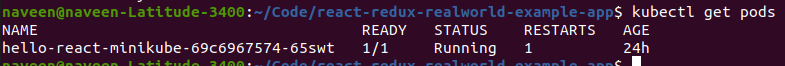
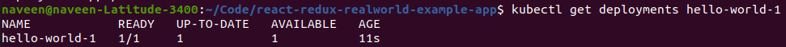
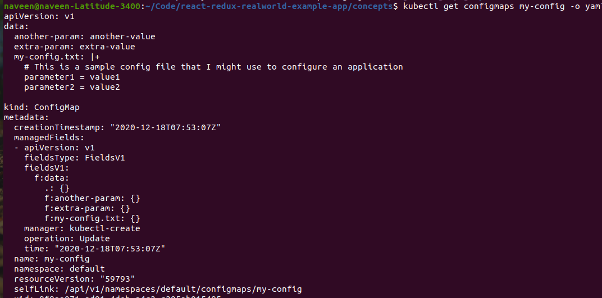
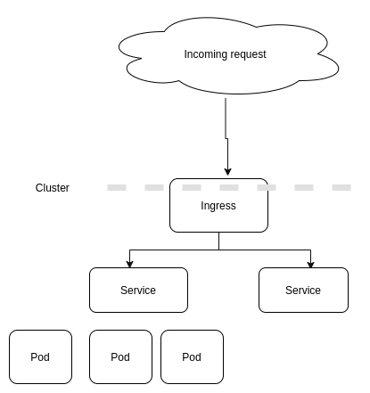

### Kubernetes concepts


Kubernetes Architecture 


Cluster - 
  - Collection of nodes (hosts), storage, and network resources, used to run workload.
  - Every cluster will have at least one master
  
  ```shell
    kubectl get nodes
  ```
  

Master - 
  - Control pane of kubernetes
  - Schedules workload in the form of pods and handle all events   
  - made up of number of components
      - API Server (kube-server)
      - etcd (key-value store to store all k8s data, store stateful data
      - scheduler (schedules new workloads on the nodes in the cluster)
      - controller-manger (ensures the work load that are being controlled are running as they should) 

    
    ```shell
    kubectl get pods --all-namespaces
    ```

Node (in past also known as minions)- 
  - Controlled by the master
  - Made up of a few component 
    - Kubelet (A k8s agent so that it can work with the master via the API server)
    - Kube Proxy (Network proxy that runs on the each node)
    - Pod (Wrapper around the containerized workloads)
    

```shell
kubectl get nodes -o=wide
```


Understanding of the concepts

1. Pods / Containers
- The unit of work in k8s
- Pods contains containers, containers contains app (webserver, db etc),
  A pod can have onc container or multiple container, usually we use only one container in a pod.
- All containers in a pod have the same IP and can communicate with each other.
- All container in a pod have access to the same shared storage.
- Every pod has a unique UUID to identify it.


```shell
kubectl get pods
```


```shell
kubectl run kuard --generator=run-pod/v1 \
--image=gcr.io/kuar-demo/kuard-amd64:blue
```


```shell
kubectl delete pods/kuard-demo
```


```shell
kubectl apply -f concepts/kuard-pod.yaml
```


Port forwarding
```shell
kubectl port-forward kuard-demo 8080:8080
```


Running Commands in Your Container with exec

```shell
kubectl exec kuard-demo date
```


2. Services -
   
   A service is a type of Kubernetes resource that is configured to forward requests to set a pods.
   Services have an IP address and this address automatically routes to a healthy pod.

Types of Kubernetes services:

- ClusterIP: This default type exposes the service on a cluster-internal IP. You can reach the service only from within the cluster.
- NodePort: This type of service exposes the service on each node’s IP at a static port. A ClusterIP service is created automatically, and the NodePort service will route to it. From outside the cluster, you can contact the NodePort service by using “<NodeIP>:<NodePort>”.
- LoadBalancer: This service type exposes the service externally using the load balancer of your cloud provider. The external load balancer routes to your NodePort and ClusterIP services, which are created automatically.
- ExternalName: This type maps the service to the contents of the externalName field (e.g., foo.bar.example.com). It does this by returning a value for the CNAME record.


Creating a service -
- 
    ```shell
    kubectl create deployment hello-world-1 --image=gcr.io/google-samples/node-hello:1.0 --port=8080
    ```
- 
    ```shell
     kubectl get deployments hello-world-1
    ```
- 
    ```shell
    kubectl expose deployment hello-world-1 --type=ClusterIP --name=example-service-1 service "example-service-1" exposed
    ```
- 
    ```shell
    kubectl get service example-service-1
    ```
- 
    ```shell
    kubectl port-forward service/example-service-1 8080:8080
    ```
  


3. Configmap

- ConfigMaps are used to provide configuration information for workloads. This can either be fine-grained information (a short string) or a composite value in the form of a file.
- three main ways to use a ConfigMap
    - Filesystem - We can mount a ConfigMap into a Pod. A file is created for each entry based on
      the key name. The contents of that file are set to the value.
    - Environment variable - A ConfigMap can be used to dynamically set the value of an environment
      variable.
    - Command-line argument - Kubernetes supports dynamically creating the command line for a container
      based on ConfigMap values.


```shell
kubectl create configmap my-config \
--from-file=my-config.txt \
--from-literal=extra-param=extra-value \
--from-literal=another-param=another-value
```



```shell
kubectl get configmaps my-config -o yaml
```
4. Secrets
- Secrets are similar to
  ConfigMaps but focused on making sensitive information available to the workload.
  They can be used for things like credentials or TLS certificates.
- Secrets can be consumed using the Kubernetes REST API or Secrets volumes
- Secrets volumes are managed by the kubelet and are created at Pod creation time. Secrets are stored on
  tmpfs volumes (aka RAM disks), and as such are not written to disk on nodes.
- A special use case for secrets is to store access credentials for private Docker registries.
   

```shell
kubectl create secret generic kuard-tls \
--from-file=kuard.crt \
--from-file=kuard.key
```


```shell
kubectl describe secrets kuard-tls
```


5. Ingress

- Ingress exposes HTTP and HTTPS routes from outside the cluster to services within the cluster. Traffic routing is controlled by rules defined on the Ingress resource.
- Ingress may provide load balancing, SSL termination and name-based virtual hosting.
- Name-based virtual host and URI-based routing support




6. Liveliness and Readiness
   
```shell
kubectl apply -f kuard-pod-health.yaml
kubectl port-forward kuard 8080:8080
```


Liveness determines if an application is running properly. Containers that fail liveness checks are restarted.
Readiness describes when a container is ready to serve user requests. Containers that fail readiness checks are removed from service load balancers. Readiness probes are configured similarly to liveness probes.

Once the kuard process is up and running, we need a way to confirm that it is
actually healthy and shouldn’t be restarted. Liveness probes are defined per container,
which means each container inside a Pod is health-checked separately.
The preceding Pod manifest uses an httpGet probe to perform an HTTP GET request
against the /healthy endpoint on port 8080 of the kuard container. The probe sets an
initialDelaySeconds of 5 , and thus will not be called until 5 seconds after all the
containers in the Pod are created. The probe must respond within the 1-second time‐
out, and the HTTP status code must be equal to or greater than 200 and less than 400
to be considered successful. Kubernetes will call the probe every 10 seconds. If more
than three consecutive probes fail, the container will fail and restart.

Combining the readiness and liveness probes helps ensure only healthy containers are running within the cluster.

7. Rollout

rollout manages a deployment

- kubectl rollout history deployment/abc : view rollout history
- kubectl rollout pause deployment/abc : Mark the provided resource as paused
- kubectl rollout resume deployment/abc : Resume a paused resource
- kubectl rollout undo deployment/abc : undoes a previous rollout


```shell
kubectl apply -f https://k8s.io/examples/controllers/nginx-deployment.yaml
```


```shell
kubectl rollout status deployment/nginx-deployment
```


```shell
kubectl get pods --show-labels
```
