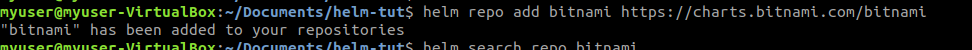
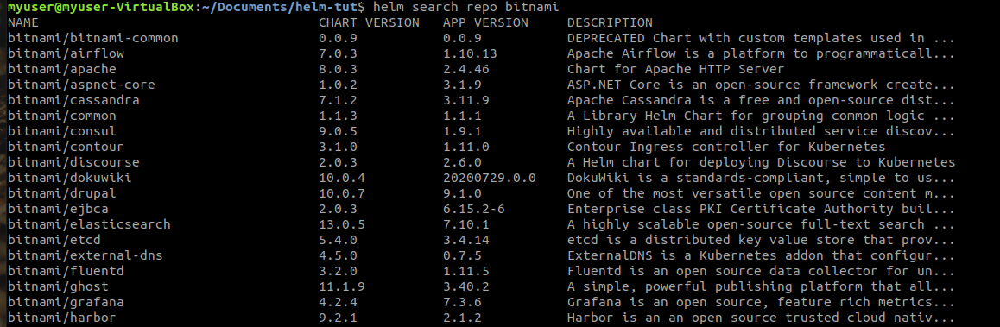
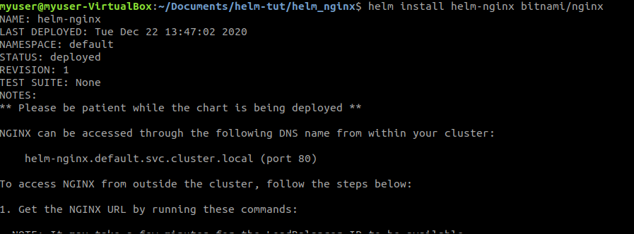
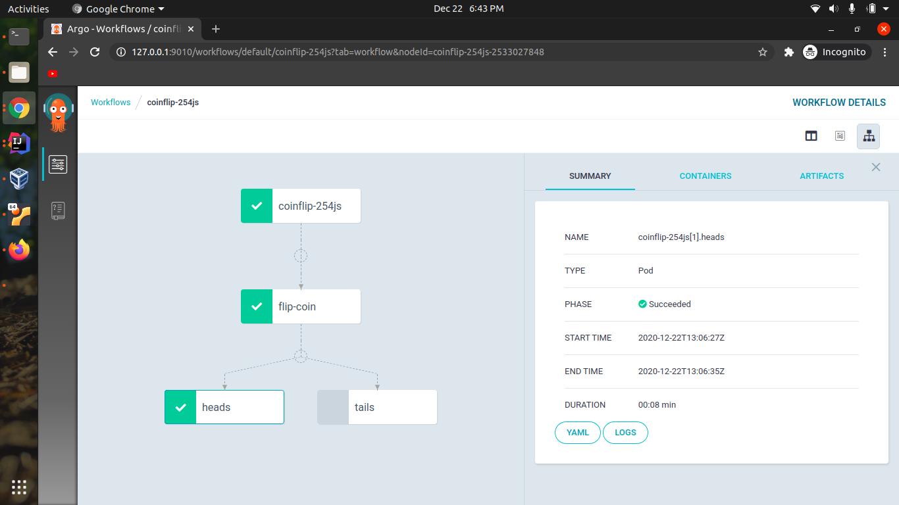

### helm


- Helm is package manager for Kubernetes.
- Helm packages are called charts
- Helm charts help define, install and upgrade complex Kubernetes application
- Helm charts can be versioned, shared and published.
- Helm charts can accept input parameter


```shell
helm repo add bitnami https://charts.bitnami.com/bitnami
```


```shell
helm search repo bitnami
```



For downloading source
```shell
helm pull bitnami/nginx --untar=true --untardir=helm_nginx
```

```shell
helm install helm-nginx bitnami/nginx
```



### argo workflow

Agro workflows is a container-native workflow engine for orchestrating jobs on Kubernetes.

Create and run advanced workflows entirely on Kubernetes.


```shell
kubectl create namespace argo
```

```shell
kubectl create rolebinding default-admin --clusterrole=admin --serviceaccount=default:default
```

```shell
kubectl create configmap -n argo workflow-controller-configmap --from-literal=config="containerRuntimeExecutor: pns"
```

```shell
kubectl apply -n argo -f https://raw.githubusercontent.com/argoproj/argo/v2.4.3/manifests/install.yaml
```

```shell
kubectl create -f https://raw.githubusercontent.com/argoproj/argo/master/examples/coinflip.yaml
```

```shell
kubectl port-forward -n argo svc/argo-ui 9010:80
```

