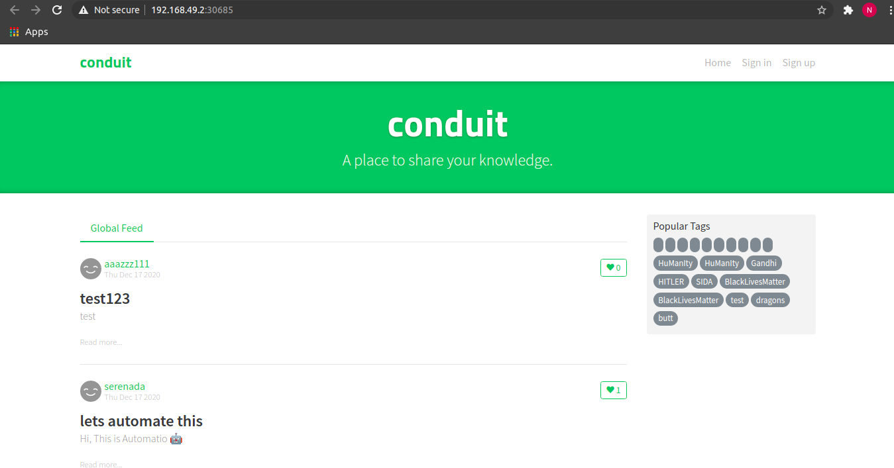

# st-task1

Containerize the following repo:
https://github.com/gothinkster/react-redux-realworld-example-app and deploy it in the Kubernetes.

```shell
git clone git@github.com:snghnaveen/st-task1.git
cd st-task1
```

Building docker image -
```shell
docker build -t react-sample:v1 .
```

Since we are deploying app in the local using minikube we don't want to fetch image from docker hub, we want to local image instead built in the above step </br>
Reference : https://stackoverflow.com/a/42564211


```shell
minikube start
minikube dashboard


#only valid for current terminal session
eval $(minikube docker-env)
```


Reference :  https://minikube.sigs.k8s.io/docs/start/

- Create a sample deployment and expose it on port 4100
    ```shell
    kubectl create deployment hello-react-minikube --image=react-sample:v1
    ```
    
    ```shell
    kubectl expose deployment hello-react-minikube --type=NodePort --port=4100
    ```

- service state
    ```shell
    kubectl get services hello-react-minikube
    ```
- launch a web browser
    ```shell
    minikube service hello-react-minikube
    ```
  
Output -



Additional commands - 
- Getting nodes list
    ```shell
    kubectl get nodes
    ```
  
- services which makes k8 master
    ```shell
    kubectl get pod --all-namespaces
    ```
  
- get namespaces
    ```shell
    kubectl get namespaces
    ```
  
- get deployments
  ```shell
  kubectl get deployments
  ```

- scaling deployemnts 
  ```shell
  kubectl scale deployment --replicas 20 hello-react-minikube
  ```
