### Cluster stepup k8s


```shell
sudo kubeadm init --apiserver-advertise-address=192.168.3.120 --pod-network-cidr=192.168.0.0/16
```

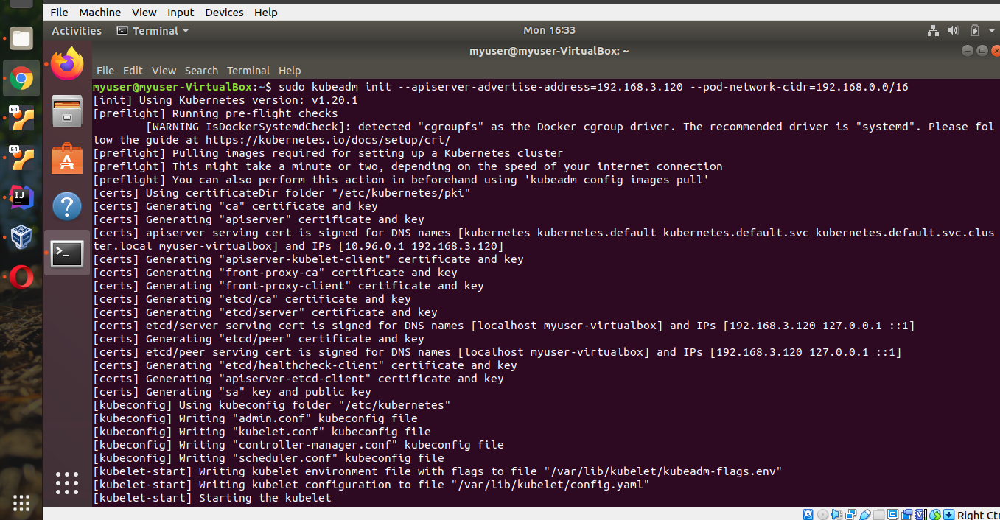


```shell
  mkdir -p $HOME/.kube
  sudo cp -i /etc/kubernetes/admin.conf $HOME/.kube/config
  sudo chown $(id -u):$(id -g) $HOME/.kube/config
```

```shell
sudo kubeadm join 192.168.3.120:6443 --token 03x2vj.rsh80ak7d2owfgv2 \
    --discovery-token-ca-cert-hash sha256:fde92e6f8a15f46d615271936fd9e991ad245ab9aeacd9a002d65b68149252ac  
```

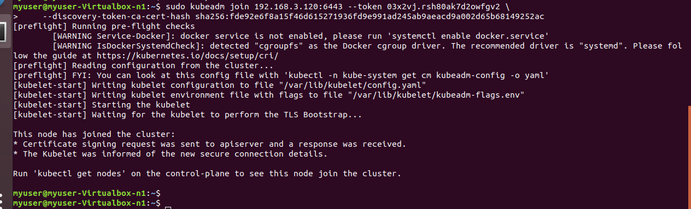

```shell
kubectl apply -f https://docs.projectcalico.org/manifests/calico.yaml
```

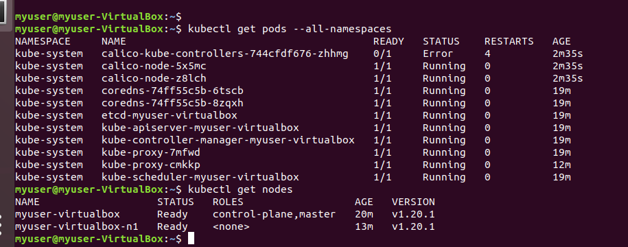


```shell
kubectl create deployment -f  nginx-pod.yaml
```
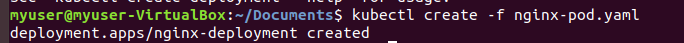


```shell
kubectl get po
```
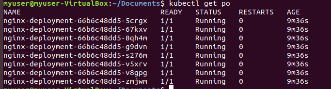

```shell
kubectl get po -o wide
```
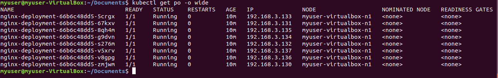

```shell
sudo docker ps
```
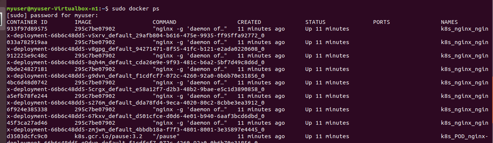


```shell
kubectl create service nodeport nginx --tcp=80:8
```

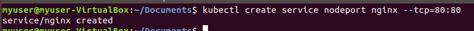

```shell
kubectl get svc
```

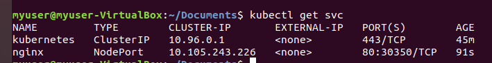


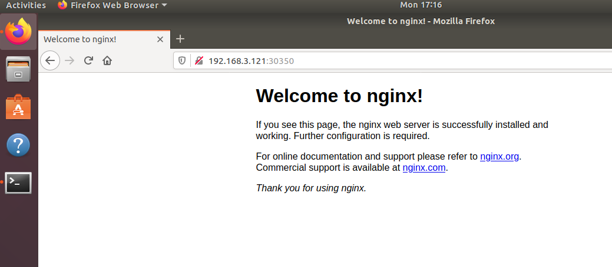


### dashboard ui setup 

```shell
kubectl apply -f https://raw.githubusercontent.com/kubernetes/dashboard/v2.0.0/aio/deploy/recommended.yaml
```

```shell
kubectl proxy
```

```shell
kubectl create serviceaccount dashboard -n default
```

```shell
kubectl create clusterrolebinding dashboard-admin -n default  --clusterrole=cluster-admin  --serviceaccount=default:dashboard
```

```shell
kubectl get secret $(kubectl get serviceaccount dashboard -o jsonpath="{.secrets[0].name}") -o jsonpath="{.data.token}" | base64 --decode
```

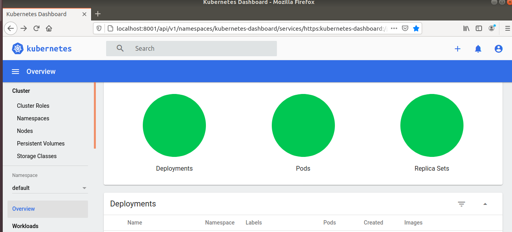


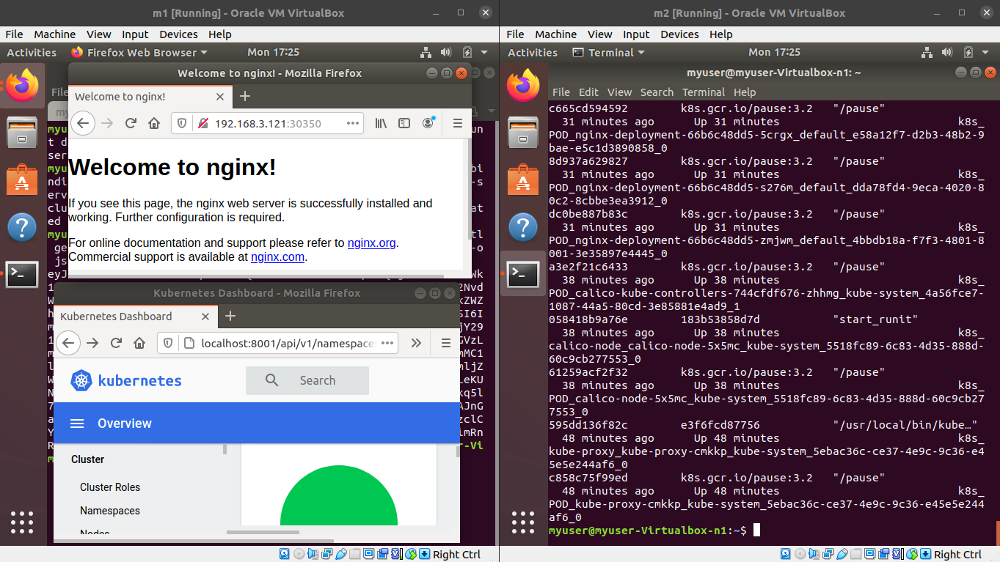